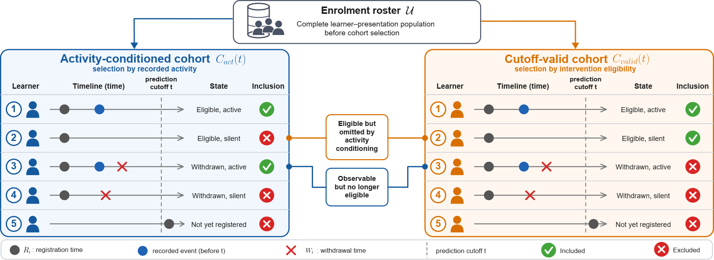
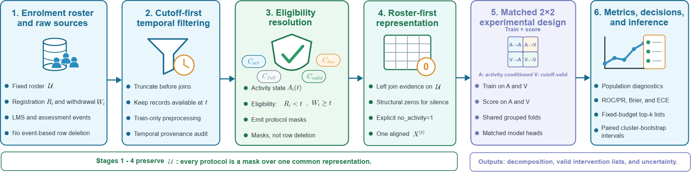
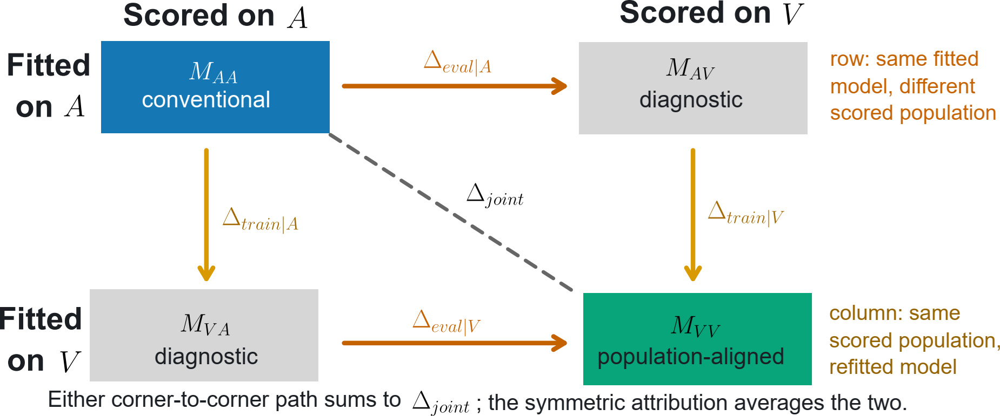

# Beyond Active Learners: Population-Valid Evaluation of Educational Early-Warning Systems

Reference implementation, analysis pipeline, and aggregate results for the
manuscript submitted to *IEEE Transactions on Learning Technologies*.

**Ngọc Luyên Lê**¹² · **Marie-Hélène Abel**² · **Bertrand Laforge**³

¹ Gamaizer, Le Raincy, France ² Université de technologie de Compiègne, CNRS,
Heudiasyc ³ Sorbonne Université, CNRS UMR 7585, LPNHE

---

## What problem does this address?

Longitudinal learning-analytics pipelines commonly build their modeling table
by aggregating a virtual-learning-environment (VLE) event table and then
joining outcomes. This *event-first* construction implicitly requires a learner
to have generated at least one recorded event before the prediction cutoff.
Two things follow, and they pull in opposite directions:

| | What happens | Consequence |
|---|---|---|
| **Eligible-silent exclusion** | A learner still enrolled and still supportable, but with no logged event, has no row to aggregate | They vanish from the modeling table without being counted as an exclusion |
| **Known-outcome contamination** | A learner who withdrew *before* the cutoff still has earlier events | They remain in the table although their outcome is already realized and no intervention is possible |

The result is that the population a model is evaluated on is not the population
an institution could actually help. We call this **risk-set misspecification**
and treat cohort definition as part of the estimand rather than as
preprocessing.



*Figure 1. Activity conditioning and intervention eligibility select different
populations. Event-first construction omits eligible-silent learners while
retaining learners whose withdrawal is already known at the prediction
cutoff.*

The framing is deliberately narrow. Risk-set and landmark methods are long
established in survival analysis; the contribution here is operationalizing
**population validity** as an evaluation dimension for educational early
warning, and separating the part of a metric difference caused by *who is
scored* from the part caused by *who the model was fitted on*.

## The four cohort protocols

At landmark week `w` with cutoff day `t = 7w`, for learner–presentation `i`
with registration `R_i`, withdrawal `W_i`, and activity indicator `A_i(t)`:

| Protocol | Definition | Role |
|---|---|---|
| Activity-conditioned `C_act` | `A_i(t) = 1` | Reproduces conventional event-first construction |
| Static-full `C_full` | all of `U` | Sensitivity analysis |
| **Cutoff-valid `C_valid`** | `R_i < t` and `W_i ≥ t` | **Primary intervention population** |
| Discrete hazard `C_haz` | eligible person–weeks | Withdrawal in `[t, t+7)` |

Silence is represented as an observed state, not as absence: event-derived
features become structural zeros and a `no_activity` indicator is set. All
protocols are **masks over one shared, roster-first feature matrix**, so a
learner present in two protocols has a bit-identical feature vector in both.



*Figure 2. The roster-first evaluation pipeline. Cutoff-first filtering,
explicit eligibility masks, and a shared feature representation preserve the
enrollment population until the matched training-by-evaluation design is
applied.*

## The 2×2 training-by-evaluation design

Comparing activity-conditioned against cutoff-valid results changes *two*
things at once — the fitted model and the scored population. This pipeline
fits both estimators and scores both populations, giving four cells:



*Figure 3. Rows hold the fitted model fixed to isolate the evaluation-population
effect; columns hold the scored population fixed to isolate the training effect.
The two corner-to-corner traversals both recover the joint contrast.*

Each component is then estimated along both traversals and averaged, so the
attribution does not depend on the order in which the two changes are applied:

```
    Δ_eval  = ½[(M_AA − M_AV) + (M_VA − M_VV)]
    Δ_train = ½[(M_AA − M_VA) + (M_AV − M_VV)]
    Δ_eval + Δ_train = M_AA − M_VV        (exactly, within every cell)
```

The identity holds cellwise to a maximum residual of 8.7 × 10⁻¹⁹. Because the
median is not linear, medians and identity-preserving means are reported side
by side.

## What the study found

Medians across 88 model–landmark cells (11 configurations × 8 landmarks) on
OULAD. Reproduce with `scripts/report_paper_numbers.py`.

| Metric | Joint (A→A vs V→V) | Δ_eval | Δ_train |
|---|---|---|---|
| ROC-AUC | +0.0345 | **+0.0339** | −0.0005 |
| PR-AUC (adverse) | +0.0732 | **+0.0715** | +0.0001 |
| Brier | −0.0109 | −0.0121 | +0.0003 |
| ECE | −0.0009 | −0.0055 | +0.0024 |

**The apparent advantage of activity conditioning is almost entirely about who
is scored, not about who the model was trained on.** Refitting on the
cutoff-valid population moves the median by ≤ 0.0005 ROC-AUC.

Three further findings:

- **The evaluation component is a net of two opposing errors.** Administrative
  noneligibility contributes +0.0406 ROC-AUC and eligible-silent exclusion
  −0.0081. A small net difference therefore does not imply a small population
  problem — ECE has a joint difference of only −0.0009 while its components are
  −0.0055 and +0.0024.
- **Decisions move more than metrics.** At a 5 % intervention budget, top-list
  Jaccard agreement between A→A and V→V is 0.187. Changing the *candidate
  population* (A→A vs A→V, 0.236) disagrees far more than *refitting*
  (A→V vs V→V, 0.706).
- **Allocation validity is not a metric artifact.** The noneligible allocation
  rate is 0.554 under A→A and exactly zero for both valid-scored
  configurations; coverage-adjusted recall rises from 0.048 to 0.114.

### Does learner overlap explain the result?

No. 12.3 % of OULAD learners appear in more than one presentation, so
presentation-grouped folds are not learner-disjoint. Refitting the full 2x2
design with **learner-grouped folds** (four configurations x eight landmarks,
everything else held fixed) leaves the discrimination conclusion unchanged:

| Metric | Fold grouping | Joint | Delta_eval | Delta_train |
|---|---|---|---|---|
| ROC-AUC | presentation | +0.0307 | +0.0301 | -0.0006 |
| ROC-AUC | **learner-disjoint** | +0.0283 | **+0.0287** | **-0.0000** |
| PR-AUC | presentation | +0.0652 | +0.0667 | -0.0003 |
| PR-AUC | **learner-disjoint** | +0.0609 | +0.0624 | +0.0004 |

Per-configuration evaluation components move by at most 0.0040 ROC-AUC, and
profile-only logistic regression keeps its negative evaluation component
(-0.0045 vs -0.0042), so the one sign-reversing family is not a leakage
artifact either. **Expected calibration error does not reproduce** - its
evaluation component changes sign - so the claim is scoped to discrimination
and Brier score. Full results in `results/oulad_learner_disjoint/`.

Boundary analyses: KDD Cup 2015 (no withdrawal timing — an *observability
proxy*, not an identified risk set) shows activity conditioning retaining only
49.0 % of the roster at week 1, converging to 100 % by week 5. A person-week
discrete-hazard benchmark preserves eligibility at every landmark.

## Repository layout

```
src/                      pipeline modules (12, ~183 KB)
  cohort_exchange.py        protocols, 2×2 design, decomposition, bootstrap
  full_evaluation.py        model families and shared heads
  pcg_ut.py                 weekly evidence loading
  evidence_mapping.py       raw -> processed weekly evidence
  features_static.py        enrolment/demographic features
  make_labels.py            outcome labels
  kdd_preprocess.py         KDD Cup 2015 preparation
  paths.py, splitters.py, traversal.py, pcg_ut_graph.py,
  build_competency_graph.py
scripts/                  entry points
  run_cohort_exchange.py         main benchmark
  report_paper_numbers.py        regenerates every number quoted in the paper
  active_eligible_comparator.py  A→A / A→(A∩V) / A→V decomposition
  aggregate_decomposition_ci.py  aggregate cluster bootstrap
  run_graph_ablation.py          supplementary ablation
results/oulad_2x2/              aggregate CSVs from the reported run
results/oulad_learner_disjoint/ learner-disjoint sensitivity arm
```

## Reproducing the results

### 1. Environment

```bash
python -m venv .venv && source .venv/bin/activate   # Windows: .venv\Scripts\activate
pip install -r requirements.txt
```

Python ≥ 3.10. The dependency list is the exact set imported by the modules
above — no deep-learning framework is required.

### 2. Data

Neither dataset is redistributed here.

- **OULAD** — download from <https://analyse.kmi.open.ac.uk/open_dataset>
  (CC BY 4.0) and place the CSVs in `data/raw/Oulab/`.
- **KDD Cup 2015** — obtain from the competition archive and place in
  `data/raw/kdd/`.

Then build the processed tables:

```bash
python -m src.make_labels
python -m src.evidence_mapping
python -m src.features_static
python -m src.kdd_preprocess          # KDD arm only
```

### 3. Main benchmark

```bash
python scripts/run_cohort_exchange.py \
    --dataset oulab --folds 5 --repeats 5 --bootstrap 2000 \
    --seed 42 --jobs 5 --output results/cohort_exchange_2x2 --verbose
```

This fits 11 configurations × 8 landmarks × 4 design cells with fixed
presentation-held-out folds. It is the expensive step (hours on a
multi-core machine). `--fit-only` stops after checkpointed predictions;
rerunning the same command resumes from checkpoints.

### 4. Verify the paper's numbers

```bash
python scripts/report_paper_numbers.py --results results/oulad_2x2
```

Every aggregate figure quoted in the manuscript is regenerated by this script
from the CSVs in `results/oulad_2x2/`, which are included in this repository.
**Reviewers can run this step without downloading the datasets or refitting
anything.**

Supporting analyses:

```bash
python scripts/active_eligible_comparator.py  --results results/oulad_2x2
python scripts/aggregate_decomposition_ci.py  --results results/oulad_2x2 --n-boot 2000
python scripts/run_graph_ablation.py                     # supplementary S4
python paper/make_figures.py                             # all figures
```

### Sensitivity arms

```bash
# Learner-disjoint cross-validation. 3,278 learners span more than one fold
# under presentation grouping; none do under learner grouping.
python scripts/run_cohort_exchange.py     --dataset oulab --split-unit learner     --models stack_7_full temporal_hgb base_lr_profile base_rf_gini     --folds 5 --repeats 5 --bootstrap 2000 --seed 42 --no-hazard     --output results/cohort_exchange_learner_disjoint

# Coarser inferential clustering (7 modules instead of 22 presentations)
python scripts/run_cohort_exchange.py --dataset oulab --cluster module ...
```

## Citation

```bibtex
@article{Le2026RiskSet,
  author  = {L\^e, Ng\d{o}c Luy\d{\^e}n and Abel, Marie-H\'el\`ene
             and Laforge, Bertrand},
  title   = {Beyond Active Learners: Population-Valid Evaluation of
             Educational Early-Warning Systems},
  journal = {IEEE Transactions on Learning Technologies},
  year    = {2026},
  note    = {Under review}
}
```

## License

Code released under the MIT License (see `LICENSE`). OULAD is distributed by
The Open University under CC BY 4.0; KDD Cup 2015 remains subject to its own
competition terms. Neither dataset is redistributed here.
