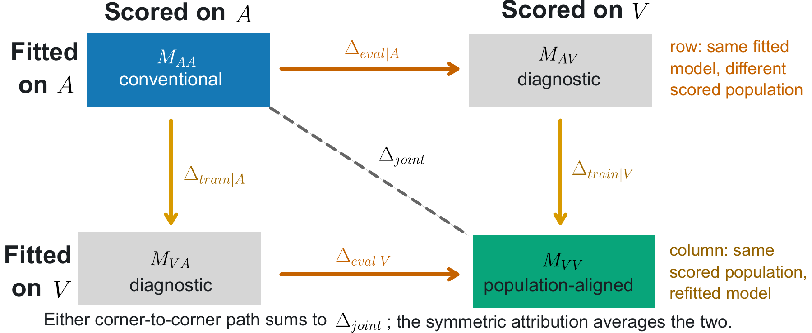

# Beyond Active Learners

Code and aggregate results accompanying *Beyond Active Learners:
Population-Valid Evaluation of Educational Early-Warning Systems*.

Educational early-warning systems can select their analysis population from
recorded activity. This can omit eligible learners with no admissible events
during the observation window and retain learners who have already withdrawn. The repository compares those
activity-conditioned populations with administratively eligible populations
using matched training and evaluation folds.

## Design

At landmark week `w`, the cutoff is day `7*w`. The activity-conditioned
population contains learners with an admissible event in `0 <= event_day < 7*w`.
"Silent" refers to absence of admissible events in that window; pre-course
events do not establish activity membership. The cutoff-valid population contains learners registered before the cutoff who
have not withdrawn before it; records with missing registration dates follow
the documented eligibility convention. A static-full arm retains all labeled
enrolments as a retrospective sensitivity analysis. A separate hazard task
predicts withdrawal during the following seven days among eligible learners.

Eligibility is specific to support intended to prevent failure or withdrawal
during the current enrolment. A post-withdrawal support service would use a
different risk set. Capacity is defined per presentation at each landmark and
counts enrolment-level selection opportunities.

The four main cells cross activity (`A`) and valid (`V`) populations for
training and evaluation:

[](figures/fig_design_matrix.pdf)

The evaluation and training components average the two paths shown above:

$$
\Delta_{\mathrm{eval}} = \frac{(M_{AA}-M_{AV})+(M_{VA}-M_{VV})}{2}
$$

$$
\Delta_{\mathrm{train}} = \frac{(M_{AA}-M_{VA})+(M_{AV}-M_{VV})}{2}
$$

These components add to `M_AA - M_VV` within each configuration–landmark cell.
Their arithmetic means also add; separately calculated medians need not.
The symmetric average is a two-factor Shapley attribution; see
[Shorrocks (2013)](https://doi.org/10.1007/s10888-011-9214-z).

Every cohort-exchange model includes `no_activity = 1 - A(t)` after roster
alignment. In particular, `base_lr_profile`, labeled **Profile LR** in the
paper and figures, uses enrolment and demographic variables **plus the
event-absence indicator**. The indicator is constant in activity-conditioned
training and varies in valid-population training. The saved
`reference_baselines.csv` files describe the base representations before this
shared alignment step. They are retained with their original run provenance.

## Reported OULAD results

Medians across eleven configurations and eight landmarks:

| Metric | Joint difference | Evaluation component | Training component |
|---|---:|---:|---:|
| ROC-AUC | +0.0248 | +0.0272 | −0.0003 |
| Adverse-outcome average precision | +0.0591 | +0.0587 | +0.0001 |
| Brier score | −0.0064 | −0.0073 | +0.0006 |
| Expected calibration error | −0.0003 | −0.0034 | +0.0022 |

Evaluation-population components generally exceed training-population components
for discrimination and Brier score. This is not universal: the direction varies
at early landmarks, Profile LR is an exception, and
calibration attribution is less stable. Learner-disjoint validation supports
the discrimination and Brier findings for the four configurations tested.

At a 5% intervention budget, median coverage-adjusted recall is:

| Training and candidate population | Median recall |
|---|---:|
| `A -> A`: activity-conditioned | 0.058 |
| `A -> (A intersect V)`: active-and-eligible | 0.110 |
| `A -> V`: activity-trained, valid candidates | 0.111 |
| `V -> V`: valid training and candidates | 0.113 |

The paired median gain from applying eligibility is +0.0544; the additional
gain from restoring silent learners is +0.0017. These gains are calculated
within each model-landmark cell before summarizing. Under fixed scores,
tie order, capacity, and the common eligible-outcome denominator, removing
noneligible candidates cannot decrease recall. Its magnitude and strict
positivity are empirical results. Restoring silent learners expands scoring
access, while net recall also depends on which active learners are displaced.

Holding activity-trained scores fixed, the candidate change `A -> A` to
`A -> V` has median top-5% list Jaccard agreement 0.284. Subsequent refitting
with the valid candidate population fixed (`A -> V` to `V -> V`) gives 0.612.
Candidate changes produce lower agreement in 69 of 88 cells along this path.
These selection diagnostics concern eligibility and eventual outcomes;
support delivery and intervention benefit require prospective evaluation.

## Read the released aggregate results

The repository includes aggregate OULAD results in:

```text
results/oulad_2x2/
results/oulad_learner_disjoint/
results/summary/
results/kdd/
```

The saved CSV and JSON tables can be read without obtaining the datasets or
fitting models. Recomputing bootstrap intervals requires the individual
prediction files produced by a local experiment; those files are not included
in this aggregate release.

`results/summary/` contains the canonical aggregate intervals, the matched
four-configuration comparison, and the exploratory eligibility/silence and
paired-recall summaries. The OULAD result directories retain the original
fitted-run protocol separately from the postprocessing provenance. KDD tables
are the unchanged boundary analysis rather than part of the OULAD rerun.

## Reproduce the OULAD experiment

### Environment

Use Python 3.10 or newer. From the repository root on Linux:

```bash
python3 -m venv .venv
source .venv/bin/activate
python3 -m pip install -r requirements.txt
```

The reported models were fitted with Python 3.10.12, NumPy 1.26.4, pandas 2.2.3,
scikit-learn 1.7.2, SciPy 1.14.1, and joblib 1.4.2. To use these recorded
versions in a Python 3.10 environment, install `requirements-fit.txt` instead.
The threadpoolctl version was not recorded and remains flexible.
Different library versions or numerical platforms can produce different fitted
predictions; exact numerical identity is not promised by the minimum-version
environment.

### Raw data and initial features

Obtain OULAD from the [Open University dataset page](https://analyse.kmi.open.ac.uk/open_dataset).
Place the supplied CSVs under `data/raw/Oulab/`. The pipeline uses
`studentInfo.csv`, `studentRegistration.csv`, `studentAssessment.csv`,
`assessments.csv`, `studentVle.csv`, and `vle.csv`.

Initialize the required fixed features, then build and validate the temporal
features without fitting models:

```bash
python3 -u scripts/prepare_oulad.py
```

This creates missing labels, course-week metadata, static features, and all
eight traversal caches before rebuilding assessment, VLE, and behavioral
features. Existing fixed feature files are retained. To repeat only the temporal
feature validation after those prerequisites exist:

```bash
python3 -u scripts/run_experiments.py --prepare-only
```

Assessments are assigned to their actual submission dates. Non-banked
submissions and VLE events enter the landmark window only when
`0 <= event_day < 7*w`; banked and pre-start assessment records are excluded.
The validation reconstructs weekly assessment and VLE aggregates from raw
timestamps and checks activity membership at every landmark. Previous derived
files are preserved in timestamped backups.

Scores are assumed available at submission: the dataset does not provide grade
release timestamps. Cohort-relative and traversal features use presentation
information available within the landmark window and are transductive.

### Fit and analyze

After preprocessing succeeds:

```bash
python3 -u scripts/run_experiments.py --skip-rebuild --jobs 5
```

This runs the eleven-model presentation-grouped experiment, the four-model
learner-disjoint analysis, the hazard benchmark, and aggregate intervals. Both
landmark analyses use five folds, five repeats, seed 42, and 2,000 paired
presentation-bootstrap draws. The launcher records logs and stops when a stage
fails; it does not change your interactive shell settings.

New outputs are written under:

```text
results/oulad_experiment/main/oulab/
results/oulad_experiment/learner_disjoint/oulab/
results/oulad_experiment/logs/
```

The same command can resume interrupted fitting when the input manifest,
source provenance, and configuration match. Use `--output-root` for another
fresh experiment directory. Existing public aggregate tables are historical
outputs, not prediction checkpoints for resuming a private run.

After generating local predictions, recompute the exploratory eligibility-first
metric split and paired gains without refitting:

```bash
python3 scripts/analyze_population_components.py --results results/oulad_experiment/main/oulab --output results/oulad_experiment/summary --budget 0.05
```

Reproduce the main, matched-four, learner-disjoint, and paired between-grouping
aggregate intervals from those same local predictions:

```bash
python3 scripts/aggregate_protocol_comparison.py --main results/oulad_experiment/main/oulab --learner results/oulad_experiment/learner_disjoint/oulab --output results/oulad_experiment/summary --n-boot 2000 --seed 42
```

## Optional KDD boundary analysis

KDD Cup 2015 lacks the withdrawal dates needed to identify the same eligibility
set. Its analysis concerns selection by observed activity rather than a fully
identified administrative risk set.

Arrange the competition files as:

```text
data/raw/KDDCup2015/date.csv
data/raw/KDDCup2015/train/enrollment_train.csv
data/raw/KDDCup2015/train/truth_train.csv
data/raw/KDDCup2015/train/log_train.csv
data/raw/KDDCup2015/test/enrollment_test.csv
data/raw/KDDCup2015/test/truth_test.csv
data/raw/KDDCup2015/test/log_test.csv
```

Then prepare and run that separate analysis:

```bash
PCG_DATASET=kdd python3 -c "from src.kdd_preprocess import write_kdd_processed; write_kdd_processed()"
python3 -u scripts/run_cohort_exchange.py --dataset kdd --reference-baselines --folds 5 --repeats 5 --seed 42 --jobs 5 --bootstrap 2000 --no-hazard --output results/kdd_experiment
```
